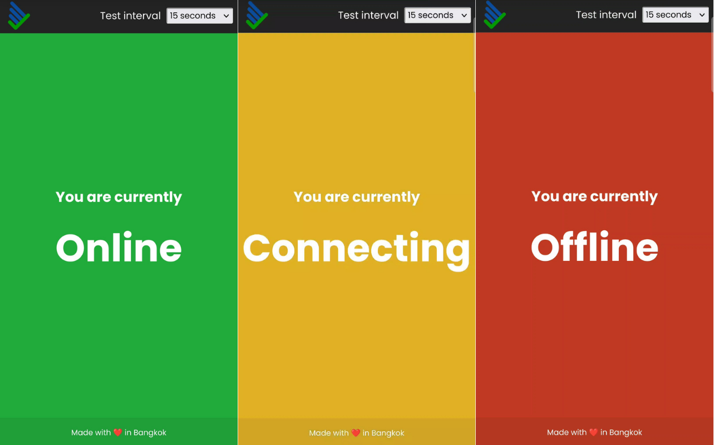

# Am-I-Online?
[Visit website](https://online.ryangl.com)
## About
This website can tell if your internet connection is working or not. Maybe your ISP is repairing the network without a clear ETA on when it will be done, or your university's campus Wi-Fi isn't showing the log-in portal. Just keep this site open in your browser and it will tell you the status of your network connection, even if you're offline!
## Features
- Shows current network status
- Offline functionality
- Timer to test every n-seconds
- Adaptive UI for mobile & desktop

## Preview

## How it works
### Offline functionality
The website has a "service worker" which stores the website resources like the HTML, CSS, and JS files. After your first visit, if you visit the website again, your browser will call the service worker to load the data saved in the browser instead of calling the web server via the net.

### Network status
Checking the network status is simple, there is a very, very tiny image stored on the website. Your browser will request the image, and if it fails, it means you're offline!